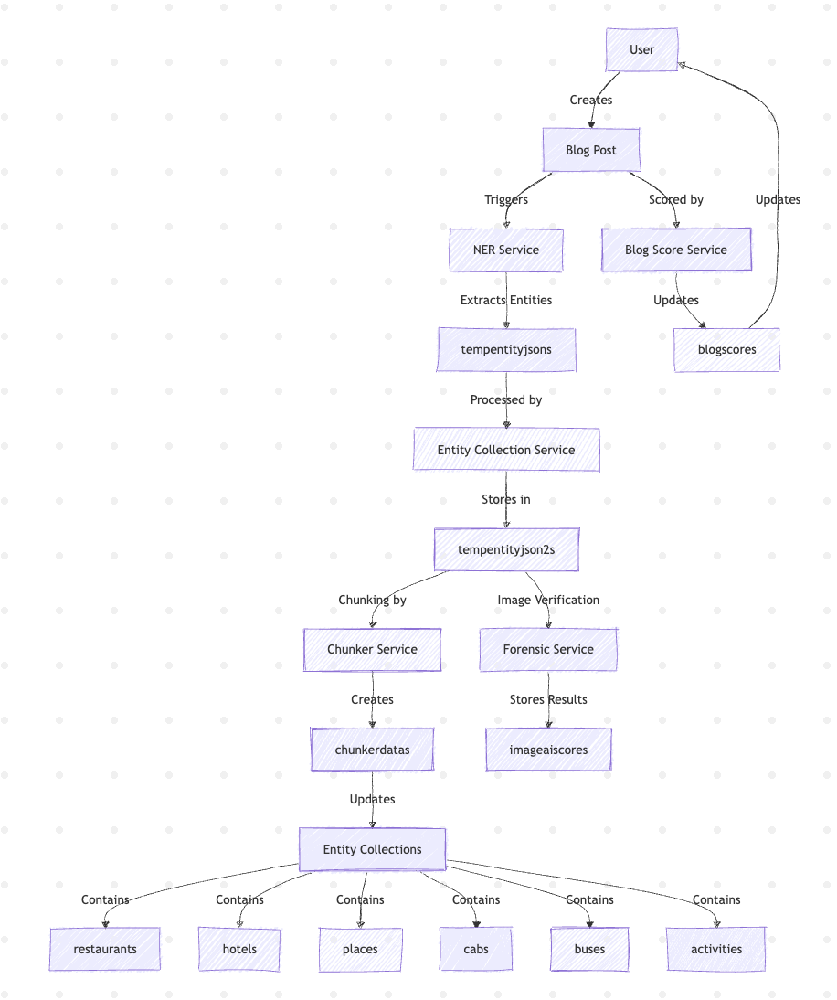
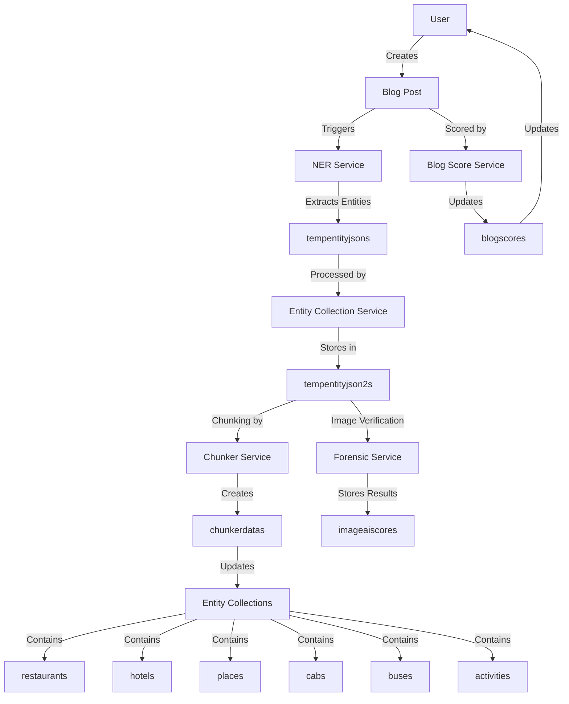
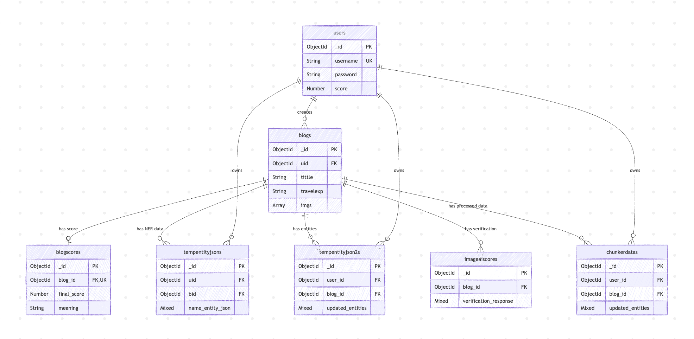
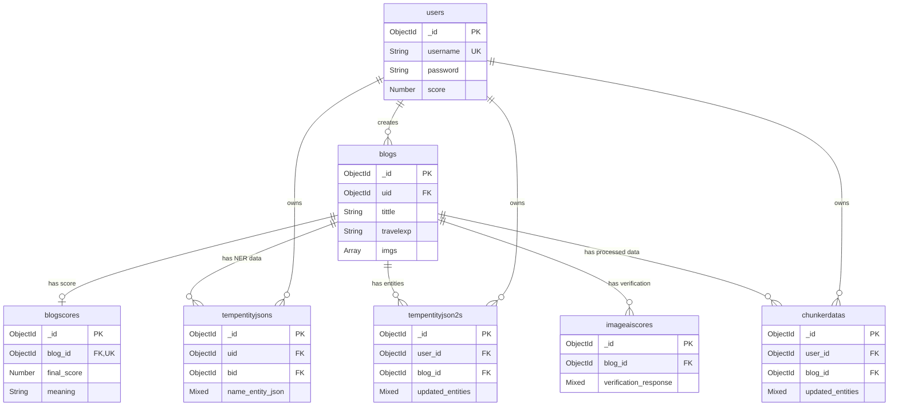

# MongoDB Data Structure Documentation

## Table of Contents
- [Overview](#overview)
- [Database Connection](#database-connection)
- [Data Flow Architecture](#data-flow-architecture)
- [Collections Overview](#collections-overview)
- [Core Application Collections](#core-application-collections)
- [Entity Collections](#entity-collections)
- [Processing Collections](#processing-collections)
- [Relationships](#relationships)
- [Indexes Summary](#indexes-summary)
- [Service Usage Matrix](#service-usage-matrix)

---

## Overview

This document provides a comprehensive overview of the MongoDB database structure used in the Travel Blog Platform. The system uses **13 collections** organized into three main categories:

1. **Core Application Collections (3)** - User management and blog content
2. **Entity Collections (6)** - Travel-related entities (restaurants, hotels, places, etc.)
3. **Processing Collections (4)** - Temporary storage and AI processing results

All collections are stored in a single MongoDB database and are accessed by the Node.js backend and various Python microservices.

---

## Database Connection

### Backend (Node.js)
- **File**: `backend/src/config/db.js`
- **Connection Method**: Mongoose ODM
- **Environment Variable**: `MONGODB_URI`

### Microservices (Python)
Services that connect to MongoDB:
- **NER Service**: Uses `tempentityjsons` collection
- **Chunker Service**: Uses `tempentityjson2s`, `chunker_datas`, `blogs` collections
- **Forensic Service**: Uses `tempentityjson2s` collection
- **Blog Score Service**: Uses `blogscores` collection

All Python services use PyMongo driver and read `MONGODB_URI` from environment configuration.

---

## Data Flow Architecture



The diagram above illustrates the complete data flow from user blog creation through all processing stages to final entity storage.

### Detailed Flow Description



---

## Collections Overview

| Collection Name | Type | Purpose | Primary Key | Related To |
|----------------|------|---------|-------------|------------|
| `users` | Core | User authentication and profiles | `_id` (uid) | blogs |
| `blogs` | Core | Travel blog posts | `_id` (blog_id) | users, blogscores |
| `blogscores` | Core | Blog quality scores | `_id` | blogs |
| `restaurants` | Entity | Restaurant information | `_id` | - |
| `places` | Entity | Tourist attractions | `_id` | - |
| `hotels` | Entity | Hotel information | `_id` | - |
| `cabs` | Entity | Cab service providers | `_id` | - |
| `buses` | Entity | Bus service providers | `_id` | - |
| `activities` | Entity | Activities and experiences | `_id` | - |
| `chunkerdatas` | Processing | Processed entity data | `_id` | users, blogs |
| `imageaiscores` | Processing | Image verification results | `_id` | blogs |
| `tempentityjsons` | Processing | NER extraction temporary storage | `_id` | users, blogs |
| `tempentityjson2s` | Processing | Entity collection temporary storage | `_id` | users, blogs |

---

## Core Application Collections

### 1. users

**Model File**: `backend/src/models/User.js`

**Purpose**: Stores user authentication information and user scores.

**Schema**:
```javascript
{
  _id: ObjectId,              // Auto-generated MongoDB ID
  username: String,           // Unique username (min: 3 chars)
  password: String,           // Hashed password (min: 6 chars)
  score: Number,              // User's total score (default: 0)
  createdAt: Date,            // Auto-generated timestamp
  updatedAt: Date,            // Auto-generated timestamp
  uid: String (virtual)       // Alias for _id (hex string)
}
```

**Field Specifications**:
| Field | Type | Required | Unique | Default | Validation |
|-------|------|----------|--------|---------|------------|
| `username` | String | ✓ | ✓ | - | minlength: 3, trimmed |
| `password` | String | ✓ | ✗ | - | minlength: 6 |
| `score` | Number | ✗ | ✗ | 0 | - |
| `createdAt` | Date | ✗ | ✗ | Auto | - |
| `updatedAt` | Date | ✗ | ✗ | Auto | - |
| `uid` | String | Virtual | - | - | Returns _id as hex string |

**Indexes**:
- `username`: Unique index

---

### 2. blogs

**Model File**: `backend/src/models/Blog.js`

**Purpose**: Stores travel blog posts created by users.

**Schema**:
```javascript
{
  _id: ObjectId,              // Auto-generated MongoDB ID
  uid: ObjectId,              // Reference to users collection
  tittle: String,             // Blog title (typo in original)
  travelexp: String,          // Travel experience content
  imgs: [String],             // Array of image URLs
  createdAt: Date,            // Auto-generated timestamp
  updatedAt: Date,            // Auto-generated timestamp
  blog_id: String (virtual)   // Alias for _id (hex string)
}
```

**Field Specifications**:
| Field | Type | Required | Reference | Default | Validation |
|-------|------|----------|-----------|---------|------------|
| `uid` | ObjectId | ✓ | User._id | - | - |
| `tittle` | String | ✓ | - | - | trimmed |
| `travelexp` | String | ✓ | - | - | - |
| `imgs` | [String] | ✗ | - | [] | Array of image URLs |
| `createdAt` | Date | ✗ | - | Auto | - |
| `updatedAt` | Date | ✗ | - | Auto | - |
| `blog_id` | String | Virtual | - | - | Returns _id as hex string |

**Indexes**:
- None explicitly defined (default _id index only)

---

### 3. blogscores

**Model Files**: 
- `backend/src/models/BlogScore.js` (Node.js)
- `blog_score_Service/models/blog_score.py` (Python)

**Purpose**: Stores comprehensive quality scores for blog posts.

**Schema**:
```javascript
{
  _id: ObjectId,
  blog_id: ObjectId,                  // Reference to blogs collection (UNIQUE)
  content_depth_score: Number,        // 0-20 points
  entity_richness_score: Number,      // 0-20 points
  proof_support_score: Number,        // 0-20 points
  authenticity_score: Number,         // 0-15 points
  language_quality_score: Number,     // 0-15 points
  ai_risk_score: Number,              // 0-10 points
  final_score: Number,                // 0-100 points (sum of above)
  meaning: String,                    // Quality category
  createdAt: Date,
  updatedAt: Date
}
```

**Field Specifications**:
| Field | Type | Required | Min | Max | Default | Values |
|-------|------|----------|-----|-----|---------|--------|
| `blog_id` | ObjectId | ✓ | - | - | - | Unique reference |
| `content_depth_score` | Number | ✗ | 0 | 20 | 0 | - |
| `entity_richness_score` | Number | ✗ | 0 | 20 | 0 | - |
| `proof_support_score` | Number | ✗ | 0 | 20 | 0 | - |
| `authenticity_score` | Number | ✗ | 0 | 15 | 0 | - |
| `language_quality_score` | Number | ✗ | 0 | 15 | 0 | - |
| `ai_risk_score` | Number | ✗ | 0 | 10 | 0 | - |
| `final_score` | Number | ✗ | 0 | 100 | 0 | Sum of all scores |
| `meaning` | String | ✗ | - | - | 'low quality' | exceptional, very good, average, weak, low quality |

**Meaning Categories**:
- **exceptional**: final_score >= 90
- **very good**: final_score >= 75
- **average**: final_score >= 60
- **weak**: final_score >= 40
- **low quality**: final_score < 40

**Indexes**:
- `blog_id`: Unique index
- `final_score`: Descending index (for sorting)

---

## Entity Collections

All entity collections share a similar structure with location-based deduplication using compound unique indexes.

### Common Entity Pattern

**Common Fields Across All Entity Collections**:
- `city`: String (required)
- `state`: String (required)
- `rating`: [String] (array, default: [])
- `description`: [String] (array, default: [])
- `image_urls`: [String] (array, default: [])
- `createdAt`: Date (auto-generated)
- `updatedAt`: Date (auto-generated)

---

### 4. restaurants

**Model File**: `backend/src/models/Restaurant.js`

**Purpose**: Stores restaurant information extracted from blog posts.

**Schema**:
```javascript
{
  _id: ObjectId,
  restaurant_name: String,    // Restaurant name
  city: String,               // City location
  state: String,              // State location
  rating: [String],           // Multiple ratings from different blogs
  description: [String],      // Multiple descriptions
  image_urls: [String],       // Associated images
  createdAt: Date,
  updatedAt: Date
}
```

**Unique Constraint**: Compound index on `(restaurant_name, city, state)`

---

### 5. places

**Model File**: `backend/src/models/Place.js`

**Purpose**: Stores tourist attractions and places of interest.

**Schema**:
```javascript
{
  _id: ObjectId,
  place_name: String,         // Place/attraction name
  city: String,               // City location
  state: String,              // State location
  rating: [String],           // Multiple ratings
  description: [String],      // Multiple descriptions
  image_urls: [String],       // Associated images
  createdAt: Date,
  updatedAt: Date
}
```

**Unique Constraint**: Compound index on `(place_name, city, state)`

---

### 6. hotels

**Model File**: `backend/src/models/Hotel.js`

**Purpose**: Stores hotel and accommodation information.

**Schema**:
```javascript
{
  _id: ObjectId,
  hotel_name: String,         // Hotel name
  city: String,               // City location
  state: String,              // State location
  rating: [String],           // Multiple ratings
  description: [String],      // Multiple descriptions
  image_urls: [String],       // Associated images
  createdAt: Date,
  updatedAt: Date
}
```

**Unique Constraint**: Compound index on `(hotel_name, city, state)`

---

### 7. cabs

**Model File**: `backend/src/models/Cab.js`

**Purpose**: Stores cab and taxi service information.

**Schema**:
```javascript
{
  _id: ObjectId,
  service_name: String,       // Cab service name
  city: String,               // City location
  state: String,              // State location
  rating: [String],           // Multiple ratings
  contact: [String],          // Contact information
  description: [String],      // Multiple descriptions
  image_urls: [String],       // Associated images
  createdAt: Date,
  updatedAt: Date
}
```

**Unique Field**: `contact` (instead of `rating` for other transport entities)

**Unique Constraint**: Compound index on `(service_name, city, state)`

---

### 8. buses

**Model File**: `backend/src/models/Bus.js`

**Purpose**: Stores bus service and transport information.

**Schema**:
```javascript
{
  _id: ObjectId,
  service_name: String,       // Bus service name
  city: String,               // City location
  state: String,              // State location
  rating: [String],           // Multiple ratings
  contact: [String],          // Contact information
  description: [String],      // Multiple descriptions
  image_urls: [String],       // Associated images
  createdAt: Date,
  updatedAt: Date
}
```

**Unique Field**: `contact` (instead of `rating` for other transport entities)

**Unique Constraint**: Compound index on `(service_name, city, state)`

---

### 9. activities

**Model File**: `backend/src/models/Activity.js`

**Purpose**: Stores activities, experiences, and things to do.

**Schema**:
```javascript
{
  _id: ObjectId,
  activity_name: String,      // Activity name
  type: String,               // Activity type/category
  city: String,               // City location
  state: String,              // State location
  description: [String],      // Multiple descriptions
  image_urls: [String],       // Associated images
  createdAt: Date,
  updatedAt: Date
}
```

**Unique Field**: `type` (categorizes the activity)

**Unique Constraint**: Compound index on `(activity_name, city, state)`

---

## Processing Collections

### 10. chunkerdatas

**Model File**: `backend/src/models/ChunkerData.js`

**Purpose**: Stores processed entity data after chunking and description extraction by the Chunker Service.

**Schema**:
```javascript
{
  _id: ObjectId,
  user_id: ObjectId,          // Reference to users collection
  blog_id: ObjectId,          // Reference to blogs collection
  updated_entities: Mixed,    // Flexible JSON structure with processed entities
  createdAt: Date,
  updatedAt: Date
}
```

**Field Specifications**:
| Field | Type | Required | Reference | Index |
|-------|------|----------|-----------|-------|
| `user_id` | ObjectId | ✓ | User._id | ✓ |
| `blog_id` | ObjectId | ✓ | Blog._id | ✓ |
| `updated_entities` | Mixed | ✓ | - | ✗ |

**Indexes**:
- `user_id`: Single field index
- `blog_id`: Single field index
- `(user_id, blog_id)`: Compound index

**Used By**: Chunker Service (`chunker-service/app.py`)

---

### 11. imageaiscores

**Model File**: `backend/src/models/ImageAIScore.js`

**Purpose**: Stores image verification and forensic analysis results.

**Schema**:
```javascript
{
  _id: ObjectId,
  blog_id: ObjectId,                  // Reference to blogs collection
  verification_response: Mixed,       // Flexible JSON with verification results
  created_at: Date,                   // Custom timestamp field
  metadata: {
    entities_processed: Number,       // Count of entities processed
    images_analyzed: Number,          // Count of images analyzed
    timestamp: Date                   // Processing timestamp
  }
}
```

**Field Specifications**:
| Field | Type | Required | Default | Index |
|-------|------|----------|---------|-------|
| `blog_id` | ObjectId | ✓ | - | ✓ |
| `verification_response` | Mixed | ✓ | - | ✗ |
| `created_at` | Date | ✗ | Date.now | ✓ |
| `metadata.entities_processed` | Number | ✗ | 0 | ✗ |
| `metadata.images_analyzed` | Number | ✗ | 0 | ✗ |
| `metadata.timestamp` | Date | ✗ | - | ✗ |

**Indexes**:
- `blog_id`: Single field index
- `created_at`: Descending index
- `(blog_id, created_at)`: Compound index

**Used By**: Forensic Service (`forensic-service/app.py`)

---

### 12. tempentityjsons

**Model File**: `backend/src/models/TempEntityJSON.js`

**Purpose**: Temporary storage for named entity recognition (NER) extraction results.

**Schema**:
```javascript
{
  _id: ObjectId,
  uid: ObjectId,              // Reference to users collection
  bid: ObjectId,              // Reference to blogs collection (blog_id)
  name_entity_json: Mixed,    // Flexible JSON with extracted entities
  createdAt: Date,
  updatedAt: Date
}
```

**Field Specifications**:
| Field | Type | Required | Reference | Default |
|-------|------|----------|-----------|---------|
| `uid` | ObjectId | ✓ | User._id | - |
| `bid` | ObjectId | ✓ | Blog._id | - |
| `name_entity_json` | Mixed | ✗ | - | {} |

**Indexes**: None explicitly defined

**Used By**: NER Service (`ner-service/app.py`)

**Note**: Uses different field naming convention (`uid`, `bid`) compared to other collections.

---

### 13. tempentityjson2s

**Model File**: `backend/src/models/TempEntityJSON2.js`

**Purpose**: Temporary storage for entity collection service results (second stage processing).

**Schema**:
```javascript
{
  _id: ObjectId,
  user_id: ObjectId,          // Reference to users collection
  blog_id: ObjectId,          // Reference to blogs collection
  updated_entities: Mixed,    // Flexible JSON with collected entities
  createdAt: Date,
  updatedAt: Date
}
```

**Field Specifications**:
| Field | Type | Required | Reference | Default | Index |
|-------|------|----------|-----------|---------|-------|
| `user_id` | ObjectId | ✓ | User._id | - | ✓ |
| `blog_id` | ObjectId | ✓ | Blog._id | - | ✓ |
| `updated_entities` | Mixed | ✓ | - | {} | ✗ |

**Indexes**:
- `user_id`: Single field index
- `blog_id`: Single field index
- `(user_id, blog_id)`: Compound index

**Used By**: 
- Entity Collection Service (`entity-collection-service/app.py`)
- Forensic Service (`forensic-service/app.py`)
- Chunker Service (`chunker-service/app.py`)

---

## Relationships



The diagram above shows the relationships between all collections in the database, including primary keys (PK), foreign keys (FK), and unique keys (UK).

### Detailed ER Diagram



### Foreign Key Relationships

| Collection | Field | References | Cardinality |
|------------|-------|------------|-------------|
| `blogs` | `uid` | `users._id` | Many-to-One |
| `blogscores` | `blog_id` | `blogs._id` | One-to-One |
| `tempentityjsons` | `uid` | `users._id` | Many-to-One |
| `tempentityjsons` | `bid` | `blogs._id` | Many-to-One |
| `tempentityjson2s` | `user_id` | `users._id` | Many-to-One |
| `tempentityjson2s` | `blog_id` | `blogs._id` | Many-to-One |
| `chunkerdatas` | `user_id` | `users._id` | Many-to-One |
| `chunkerdatas` | `blog_id` | `blogs._id` | Many-to-One |
| `imageaiscores` | `blog_id` | `blogs._id` | Many-to-One |

**Note**: Entity collections (restaurants, places, hotels, cabs, buses, activities) are standalone and don't have explicit foreign key relationships to other collections. They are populated from blog content but maintained independently.

---

## Indexes Summary

### Single Field Indexes

| Collection | Field | Type | Purpose |
|------------|-------|------|---------|
| `users` | `username` | Unique | User authentication lookup |
| `blogscores` | `blog_id` | Unique | One score per blog |
| `blogscores` | `final_score` | Descending | Sorting by quality |
| `chunkerdatas` | `user_id` | Standard | User filtering |
| `chunkerdatas` | `blog_id` | Standard | Blog filtering |
| `imageaiscores` | `blog_id` | Standard | Blog verification lookup |
| `imageaiscores` | `created_at` | Descending | Temporal queries |
| `tempentityjson2s` | `user_id` | Standard | User filtering |
| `tempentityjson2s` | `blog_id` | Standard | Blog filtering |

### Compound Indexes

| Collection | Fields | Type | Purpose |
|------------|--------|------|---------|
| `restaurants` | `(restaurant_name, city, state)` | Unique | Deduplication |
| `places` | `(place_name, city, state)` | Unique | Deduplication |
| `hotels` | `(hotel_name, city, state)` | Unique | Deduplication |
| `cabs` | `(service_name, city, state)` | Unique | Deduplication |
| `buses` | `(service_name, city, state)` | Unique | Deduplication |
| `activities` | `(activity_name, city, state)` | Unique | Deduplication |
| `chunkerdatas` | `(user_id, blog_id)` | Standard | Combined filtering |
| `tempentityjson2s` | `(user_id, blog_id)` | Standard | Combined filtering |
| `imageaiscores` | `(blog_id, created_at)` | Standard | Blog history queries |

---

## Service Usage Matrix

| Service | Collections Used | Operations | Purpose |
|---------|-----------------|------------|---------|
| **Backend (Node.js)** | All 13 collections | CRUD | Main API server |
| **NER Service** | `tempentityjsons` | Write | Extract named entities from blog text |
| **Entity Collection Service** | `tempentityjson2s` | Write | Collect and organize entities |
| **Chunker Service** | `tempentityjson2s`, `chunkerdatas`, `blogs` | Read/Write | Generate descriptions for entities |
| **Forensic Service** | `tempentityjson2s`, `imageaiscores` | Read/Write | Verify image authenticity |
| **Blog Score Service** | `blogscores` | Read/Write | Calculate blog quality scores |

### Processing Pipeline

1. **User creates blog** → Stored in `blogs` collection
2. **NER extraction** → Entities stored in `tempentityjsons`
3. **Entity collection** → Processed entities in `tempentityjson2s`
4. **Parallel processing**:
   - **Forensic analysis** → Results in `imageaiscores`
   - **Chunking service** → Descriptions in `chunkerdatas`
   - **Blog scoring** → Scores in `blogscores`
5. **Entity population** → Entities moved to respective collections (restaurants, hotels, etc.)
6. **User score update** → User's score updated in `users`

---

## Collection Naming Conventions

### Pluralization Pattern
- Most collections use lowercase plural form: `users`, `blogs`, `restaurants`, etc.
- Processing collections use suffix "s" or "datas": `chunkerdatas`, `imageaiscores`

### Naming Inconsistencies
1. **tempentityjsons vs tempentityjson2s**: 
   - Different stages of entity processing
   - Different field names (`uid/bid` vs `user_id/blog_id`)

2. **blogscores**: 
   - Explicitly set in model: `collection: 'blogscores'`
   - Without explicit naming, Mongoose would use `blogscores`

3. **Entity Collections**:
   - All follow pattern: `{entity_type}s` (restaurants, hotels, places, buses, cabs, activities)

---

## Data Types Reference

### MongoDB ObjectId
- 12-byte identifier
- Used for `_id` and foreign key references
- Represented as 24-character hexadecimal string in JSON

### Mixed Type (Schema.Types.Mixed)
- Flexible JSON structure
- Used for dynamic entity data in processing collections
- No schema validation applied

### Array Types
- `[String]`: Array of strings
- Default to empty array `[]` in most entity collections
- Used for multi-value fields (ratings, descriptions, images)

### Date Types
- Auto-managed by Mongoose timestamps
- Custom `created_at` field in `imageaiscores`
- Custom `createdAt`/`updatedAt` in `blogscores`

---

## Best Practices & Notes

### Deduplication Strategy
Entity collections use compound unique indexes on `(name, city, state)` to prevent duplicates while allowing same-named entities in different locations.

### Array Fields
Multiple descriptions and ratings are stored as arrays, allowing aggregation from multiple blog posts mentioning the same entity.

### Temporary Collections
`tempentityjsons` and `tempentityjson2s` serve as temporary storage during processing pipeline. Consider implementing cleanup strategies for old entries.

### Virtual Fields
`users` and `blogs` collections define virtual fields (`uid`, `blog_id`) as aliases for `_id`, providing cleaner API responses.

### Timestamps
Most collections use Mongoose automatic timestamps (`createdAt`, `updatedAt`). Exceptions:
- `blogscores`: Custom timestamp management
- `imageaiscores`: Uses `created_at` instead of `createdAt`

---

## Model File Locations

### Node.js Backend Models
```
backend/src/models/
├── User.js              (users)
├── Blog.js              (blogs)
├── BlogScore.js         (blogscores)
├── Restaurant.js        (restaurants)
├── Place.js             (places)
├── Hotel.js             (hotels)
├── Cab.js               (cabs)
├── Bus.js               (buses)
├── Activity.js          (activities)
├── ChunkerData.js       (chunkerdatas)
├── ImageAIScore.js      (imageaiscores)
├── TempEntityJSON.js    (tempentityjsons)
└── TempEntityJSON2.js   (tempentityjson2s)
```

### Python Service Models
```
blog_score_Service/models/
└── blog_score.py        (blogscores - Python implementation)
```

---

## Summary Statistics

- **Total Collections**: 13
- **Core Collections**: 3
- **Entity Collections**: 6
- **Processing Collections**: 4
- **Total Indexes**: 18+ (including compound indexes)
- **Collections with Unique Constraints**: 7
- **Collections with Compound Indexes**: 9
- **Collections Accessed by Python Services**: 5
- **Collections with Foreign Keys**: 9

---

*Last Updated: January 2026*
*Version: 1.0*
